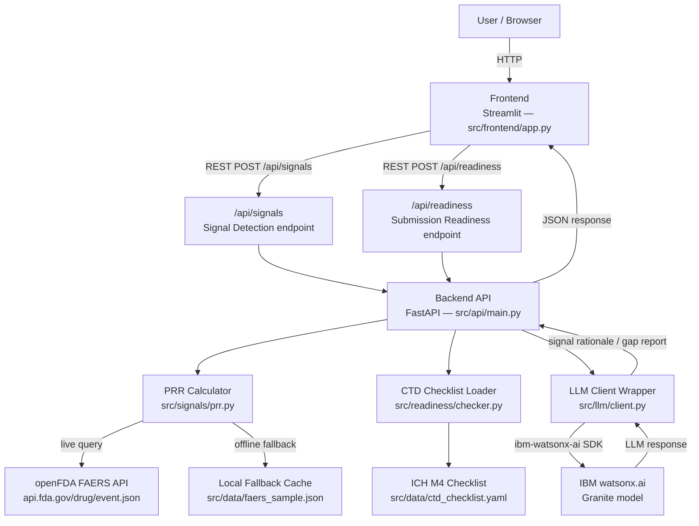

# Architecture

## System Architecture

The system is organized into four layers: a Streamlit frontend, a FastAPI backend, a shared LLM client wrapper, and external data sources (openFDA API and IBM watsonx.ai). There is no persistent database — all computation is in-memory or from static local files.



---

## Components

| Component | Technology | Location | Responsibility |
|---|---|---|---|
| **Frontend UI** | Streamlit 1.x | `src/frontend/app.py` | Two-tab web interface: Signal Detection and Submission Readiness; calls backend REST API; renders results tables and dashboards |
| **Backend API** | FastAPI (Python 3.11+) | `src/api/main.py` | Exposes `/api/signals` and `/api/readiness` endpoints; orchestrates data fetching, computation, and LLM calls; returns JSON |
| **Signal Detection Logic** | Python + pandas | `src/signals/` | Fetches FAERS data via openFDA API; groups reports by drug–event pair; computes PRR for all pairs; filters to WHO-UMC thresholds (PRR ≥ 2, n ≥ 3) |
| **FAERS Data Fetcher** | Python + httpx | `src/signals/faers.py` | Queries `https://api.fda.gov/drug/event.json`; falls back to `src/data/faers_sample.json` on network failure |
| **CTD Readiness Checker** | Python | `src/readiness/checker.py` | Loads ICH M4 checklist from YAML; fuzzy-matches user-provided section list; computes per-module completeness scores |
| **ICH M4 Checklist** | YAML data file | `src/data/ctd_checklist.yaml` | Hardcoded structured representation of all 5 CTD modules and required sections per ICH M4 (2016) |
| **FAERS Fallback Cache** | JSON data file | `src/data/faers_sample.json` | Static sample of ~200 FAERS adverse event reports across several drugs; used as offline fallback |
| **LLM Client Wrapper** | Python + ibm-watsonx-ai SDK | `src/llm/client.py` | Single-interface wrapper around IBM watsonx.ai Granite model; accepts structured prompt dicts; returns LLM response strings; swappable for alternate backends |
| **IBM watsonx.ai** | Granite model (`ibm/granite-13b-instruct-v2`) | External (IBM Cloud) | Generates: (1) plain-language clinical rationale for each flagged PRR signal; (2) regulatory gap report prose for missing CTD sections |

---

## Data Flow

### Mode 1 — Signal Detection

```
1. User submits drug name from Streamlit frontend
2. Frontend POST /api/signals  {drug_name: "ibuprofen"}
3. FastAPI receives request → calls FAERS fetcher
4. FAERS fetcher queries openFDA API:
     GET https://api.fda.gov/drug/event.json
         ?search=patient.drug.medicinalproduct:"ibuprofen"
         &limit=1000
   OR loads src/data/faers_sample.json on API failure
5. Raw event JSON → PRR Calculator (pandas):
     a. Group events by (drug_name, adverse_event_term)
     b. Build 2×2 contingency table per pair
     c. Compute PRR = [a/(a+b)] / [c/(c+d)]
     d. Filter: PRR ≥ 2.0 AND count ≥ 3
     e. Sort descending by PRR
6. Top N signals → LLM Client:
     Prompt: structured list of (drug, event, PRR, count)
     Model: ibm/granite-13b-instruct-v2
     Task: Generate plain-language clinical rationale per signal
7. LLM response parsed → signals enriched with rationale field
8. Response JSON → Frontend → rendered as ranked table
```

### Mode 2 — Submission Readiness

```
1. User pastes/uploads dossier outline from Streamlit frontend
2. Frontend POST /api/readiness  {outline: ["Module 1...", "3.2.S...", ...]}
3. FastAPI receives request → calls CTD Checker
4. CTD Checker:
     a. Loads src/data/ctd_checklist.yaml
     b. Normalizes user outline (lowercase, strip whitespace)
     c. Fuzzy-match each required section against user outline
     d. Mark each section: PRESENT | MISSING
5. Completeness scorer:
     a. Per-module score = present_sections / required_sections * 100
     b. Overall score = total_present / total_required * 100
6. Missing sections list → LLM Client:
     Prompt: module name, missing sections, ICH M4 context
     Model: ibm/granite-13b-instruct-v2
     Task: Generate regulatory gap report in prose
7. LLM response → gap report string
8. Response JSON → Frontend → rendered as dashboard + gap report
```

---

## API Endpoints

### `POST /api/signals`

**Request:**
```json
{
  "drug_name": "ibuprofen",
  "limit": 1000
}
```

**Response:**
```json
{
  "drug_name": "ibuprofen",
  "total_reports": 847,
  "signals": [
    {
      "drug": "ibuprofen",
      "adverse_event": "Gastrointestinal hemorrhage",
      "prr": 4.73,
      "report_count": 62,
      "rationale": "Ibuprofen inhibits COX-1, reducing prostaglandin synthesis..."
    }
  ],
  "fallback_used": false
}
```

---

### `POST /api/readiness`

**Request:**
```json
{
  "outline": [
    "1.0 Cover letter",
    "2.3 Quality Overall Summary",
    "3.2.S Drug Substance",
    "5.5 Clinical Study Reports"
  ]
}
```

**Response:**
```json
{
  "overall_score": 61.3,
  "modules": [
    {
      "module": "Module 3 — Quality",
      "score": 77.8,
      "present": 14,
      "required": 18,
      "missing": ["3.2.S.7 Stability", "3.2.P.8 Stability"]
    }
  ],
  "gap_report": "The submission is missing critical stability documentation..."
}
```

---

## Directory Structure

```
src/
├── api/
│   ├── main.py              # FastAPI app, route definitions
│   ├── models.py            # Pydantic request/response schemas
│   └── __init__.py
├── signals/
│   ├── faers.py             # openFDA API fetcher + fallback loader
│   ├── prr.py               # PRR computation (pandas)
│   └── __init__.py
├── readiness/
│   ├── checker.py           # CTD checklist loader + diff engine
│   ├── scorer.py            # Completeness scoring per module
│   └── __init__.py
├── llm/
│   ├── client.py            # ibm-watsonx-ai SDK wrapper
│   ├── prompts.py           # Prompt templates for Mode 1 and Mode 2
│   └── __init__.py
├── data/
│   ├── faers_sample.json    # Offline fallback dataset (~200 FAERS reports)
│   └── ctd_checklist.yaml  # ICH M4 CTD 5-module section checklist
├── frontend/
│   └── app.py               # Streamlit two-tab UI
├── .env.example             # All required environment variables
├── requirements.txt
└── README.md
```

---

## Security Considerations

- **API keys stored in environment variables only** — `WATSONX_API_KEY`, `WATSONX_PROJECT_ID`, `WATSONX_URL` are loaded via `python-dotenv`; never committed to git (`.env` is in `.gitignore`)
- **No user data persisted** — all computation is in-memory; no adverse event or dossier data written to disk or transmitted beyond the request lifecycle
- **openFDA API is public, no key required** — no credentials exposed for the primary data source
- **CORS configured for localhost only** — FastAPI CORS middleware restricted to `http://localhost:8501` (Streamlit default port) for local demo; production deployment would restrict to known origins

---

## Scalability Notes

This is a hackathon MVP optimized for a runnable single-machine demo, not production scale. The following paths to production scalability exist:

| Bottleneck | Current State | Production Path |
|---|---|---|
| **FAERS data volume** | 1,000 reports per query via public API | Bulk FAERS quarterly download + local indexed store (DuckDB or Parquet) |
| **PRR computation speed** | In-memory pandas on each request | Pre-computed PRR matrix updated nightly; cache in Redis |
| **LLM latency** | Synchronous watsonx.ai call (~2–5s) | Async queue (Celery + Redis); streaming responses via SSE |
| **Backend concurrency** | Single Uvicorn worker | Gunicorn + multiple Uvicorn workers; stateless = horizontally scalable |
| **CTD checklist coverage** | Title-level presence/absence | NLP-based content depth scoring; regulatory guidance version tracking |
| **Multi-jurisdiction support** | ICH M4 only (FDA/EMA shared) | Region-specific Module 1 checklists; EMA-specific PSUR requirements |
